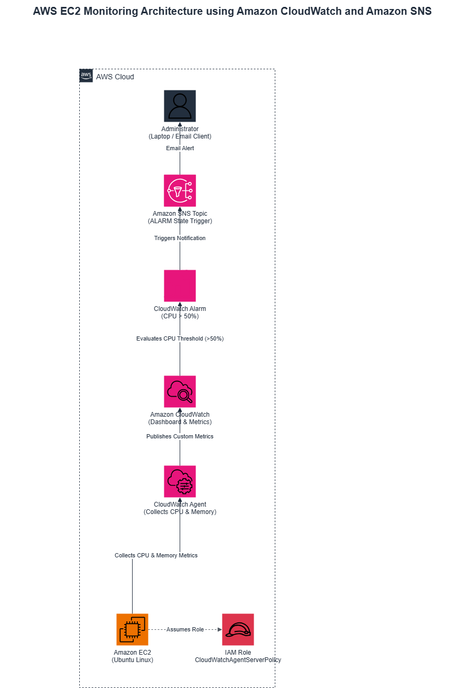
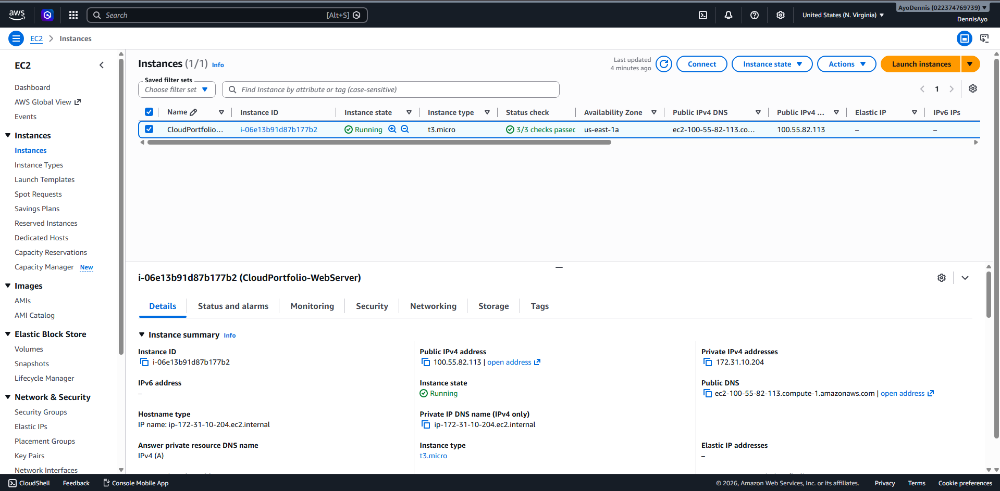
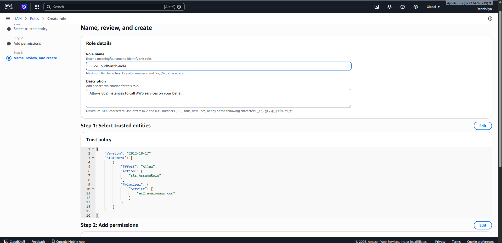
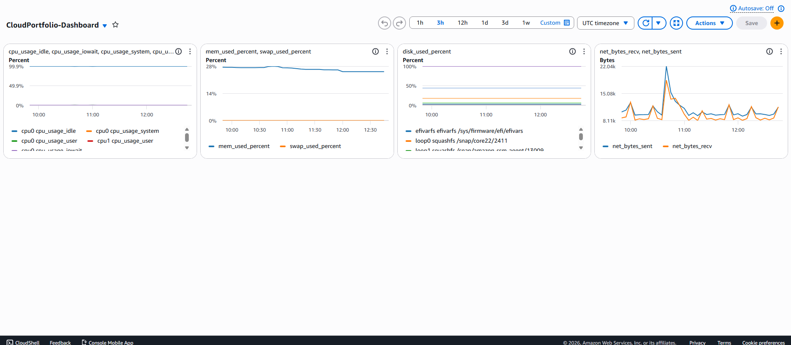
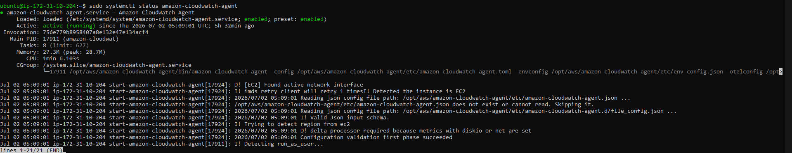
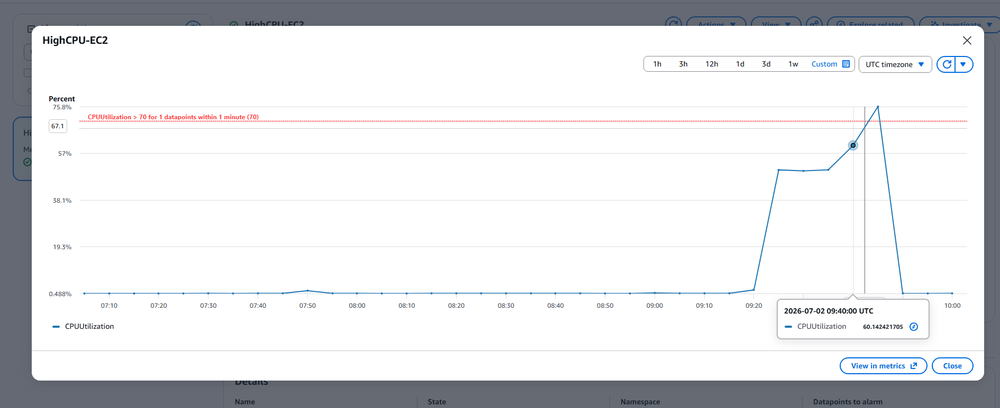
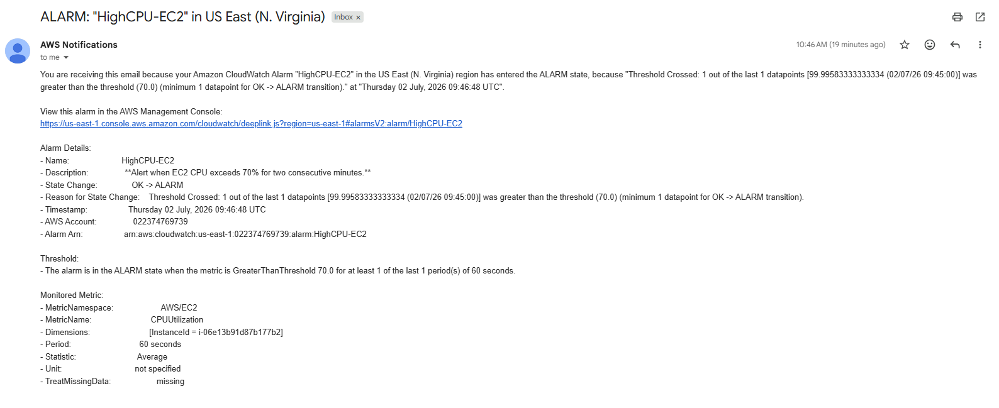
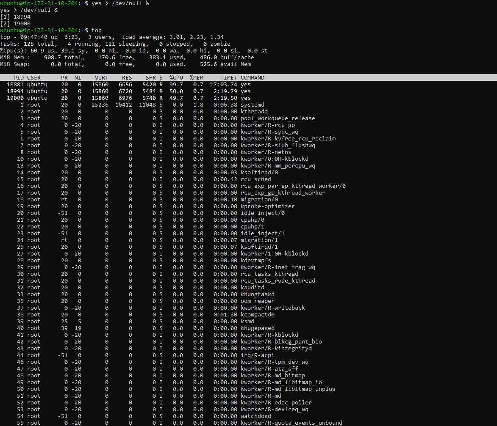

# AWS EC2 Monitoring with Amazon CloudWatch, IAM, and Amazon SNS

A hands-on AWS Cloud Engineering project demonstrating how to deploy an Amazon EC2 instance, configure the Amazon CloudWatch Agent, create custom dashboards and alarms, and receive automated email notifications using Amazon SNS.

---

## 📌 Overview

This project demonstrates how to monitor an Amazon EC2 instance using Amazon CloudWatch and automatically notify an administrator when CPU utilization exceeds a defined threshold.

The solution uses IAM Roles to securely grant permissions to the CloudWatch Agent, eliminating the need for AWS access keys on the instance.

---

## 🏗️ Architecture

<p align="center">
  
</p>

### Workflow

1. An Amazon EC2 Ubuntu instance runs the CloudWatch Agent.
2. The CloudWatch Agent collects CPU and memory metrics.
3. The IAM Role attached to the EC2 instance authorizes the agent to publish metrics.
4. Amazon CloudWatch stores the metrics and displays them on a dashboard.
5. A CloudWatch Alarm continuously evaluates CPU utilization.
6. When CPU utilization exceeds **50%**, the alarm changes to the **ALARM** state.
7. The alarm triggers an Amazon SNS topic.
8. Amazon SNS sends an email notification to the administrator.

---

## ☁️ AWS Services Used

| Service | Purpose |
|----------|---------|
| Amazon EC2 | Hosts the Ubuntu Linux server |
| AWS IAM | Provides secure permissions through an IAM Role |
| Amazon CloudWatch Agent | Collects system-level metrics |
| Amazon CloudWatch | Stores metrics, dashboards, and alarms |
| CloudWatch Alarm | Detects high CPU utilization |
| Amazon SNS | Sends email notifications |

---

## 📁 Project Structure

```
aws-ec2-cloudwatch-monitoring/
│
├── README.md
├── LICENSE
├── cloudwatch-agent-config.json
│
├── Architecture/
│   └── aws-ec2-monitoring-architecture.drawio.png
│
└── screenshots/
    ├── ec2-instance.png
    ├── iam-role.png
    ├── cloudwatch-dashboard.png
    ├── cloudwatch-agent.png
    ├── cloudwatch-alarm.png
    ├── sns-email.png
    └── cpu-utilization.png
```

---

## 🚀 Deployment Steps

### 1. Launch an EC2 Instance

- Ubuntu Server
- t2.micro (AWS Free Tier)
- Configure Security Groups
- Connect using SSH

---

### 2. Create an IAM Role

Attach the following managed policy:

- CloudWatchAgentServerPolicy

Assign the IAM Role to the EC2 instance.

---

### 3. Install the CloudWatch Agent

Update packages and install the agent.

Configure the agent using the provided:

```
cloudwatch-agent-config.json
```

Start the CloudWatch Agent.

---

### 4. Create a CloudWatch Dashboard

Add widgets to monitor:

- CPU Utilization
- Memory Utilization

---

### 5. Create a CloudWatch Alarm

Configuration:

- Metric: CPU Utilization
- Threshold: Greater than 50%
- Evaluation Period: 1 minute

---

### 6. Configure Amazon SNS

- Create an SNS Topic
- Subscribe using an email address
- Confirm the subscription

Associate the SNS Topic with the CloudWatch Alarm.

---

### 7. Test the Alarm

Generate CPU load:

```bash
yes > /dev/null &
```

Verify:

- CloudWatch Alarm enters **ALARM**
- SNS sends an email notification

Stop the stress test:

```bash
pkill yes
```

---

## 📷 Screenshots

### EC2 Instance



---

### IAM Role



---

### CloudWatch Dashboard



---

### CloudWatch Agent Running



---

### CloudWatch Alarm



---

### SNS Email Notification



---

### CPU Utilization Test



---

## 🔒 Security Best Practices

- Used IAM Roles instead of AWS Access Keys
- Principle of Least Privilege
- Monitored infrastructure using CloudWatch
- Automated alerting using Amazon SNS
- Kept SSH private keys out of GitHub using `.gitignore`

---

## 💡 Skills Demonstrated

- Amazon EC2
- Linux Administration (Ubuntu)
- AWS IAM
- Amazon CloudWatch
- CloudWatch Agent
- CloudWatch Dashboards
- CloudWatch Alarms
- Amazon SNS
- Infrastructure Monitoring
- Performance Testing
- Troubleshooting
- Cloud Operations

---

## 📚 Lessons Learned

Through this project, I learned how to:

- Configure and monitor AWS infrastructure using Amazon CloudWatch.
- Securely grant permissions with IAM Roles.
- Collect custom operating system metrics using the CloudWatch Agent.
- Build CloudWatch Dashboards for infrastructure visibility.
- Configure CloudWatch Alarms for automated monitoring.
- Use Amazon SNS to deliver real-time operational alerts.
- Validate monitoring by generating CPU load on an EC2 instance.

---

## 📄 License

This project is licensed under the MIT License.
